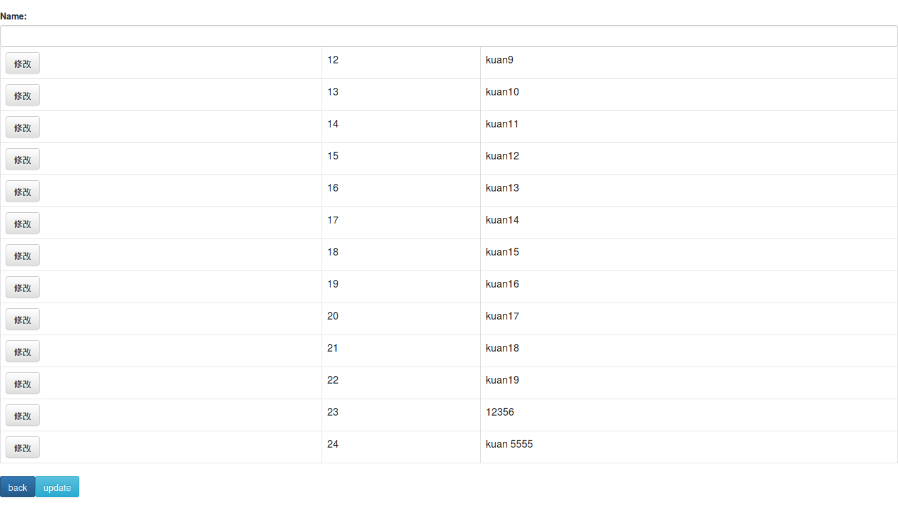

# Nodejs_CRUD_Test
practice for CRUD on nodejs

## Setting

* node version 5.3
* mysql version 5.7 (offical docker image)
* mysql port: 3306
* bootstrap
* jade(in package.json)
* querystring(in package.json)
* node mysql(in package.json)

## Table column

* id: int(11) NOT NULL AUTO_INCREMENT

* name: varchar(45)

## Path Route

> /show : show database's content

> /delete : select which data to delete then post

> /update : update data from selected row

> /insert : add new data to new row

## How to use

#### run docker with

```
docker run --name=some-mysql -p 3306:3306 -e MYSQL_ROOT_PASSWORD=123456 -d mysql
```

#### install package

```
cd ./
npm install
```

#### run server

```
cd src/
node server.js
```

#### Screen Shot



